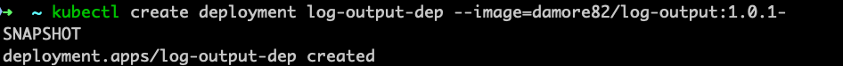
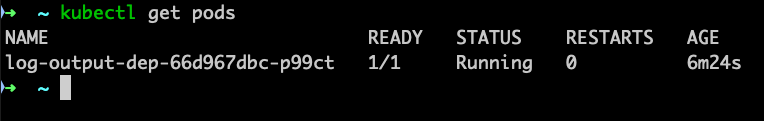
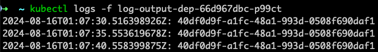

## Log Output Application

Exercise 1.01: Getting Started 

1. Application that generates a random string on startup
2. Store it on memory and outputs it every 5 seconds with timestamp
3. Deploy it on Kubernetes cluster
4. Confirm it is running with `kubectl logs...`

Evidences:

### This project uses [JIB](https://github.com/GoogleContainerTools/jib)
In other words, there will be no `Dockerfile` inside it.
